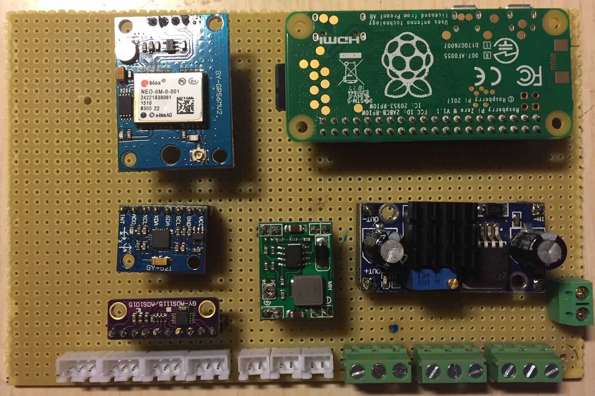
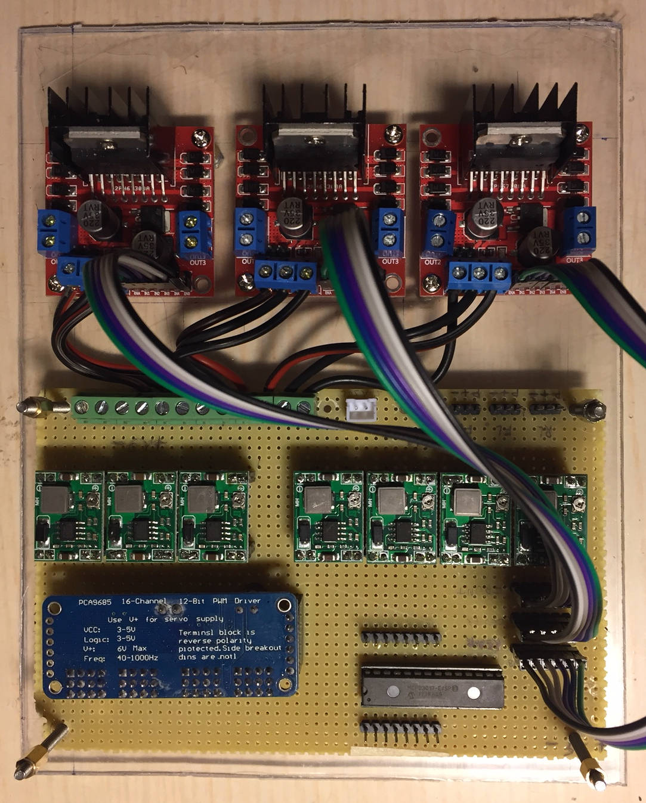
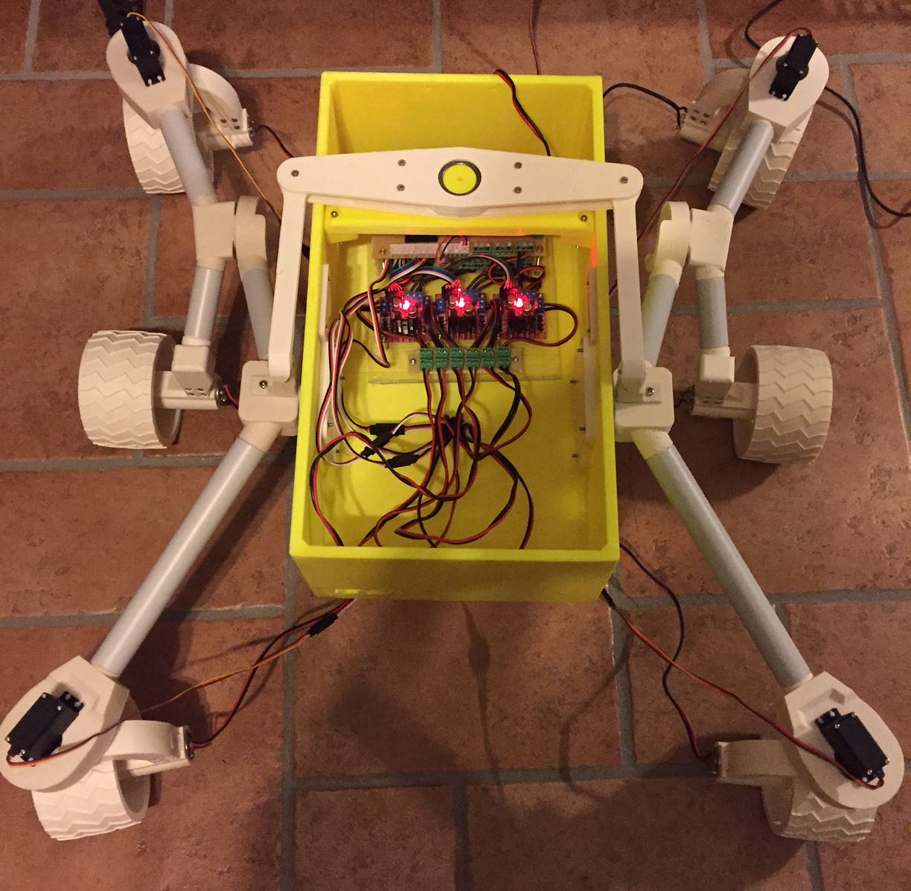
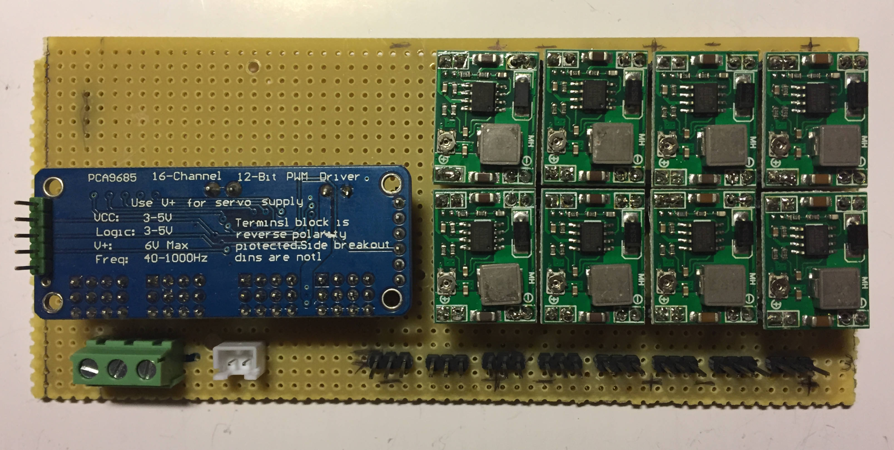
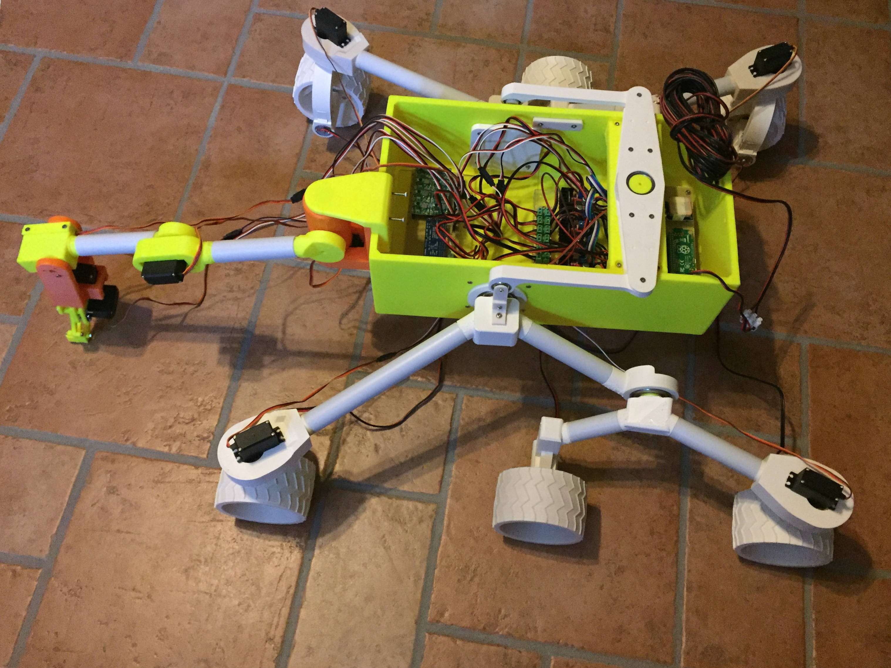

# Mars-Rover-Control-Software
Control software for [Jakkra's Mars Rover](https://github.com/jakkra/Mars-Rover)

This software has been tested and is meant to be run on a Raspberry Pi Zero W under JVM 1.8

This is currently a work in progress

### Todo list

Hardware
- [X] Raspberry Pi Zero and sensors board assembly and test
- [X] Rocker bogie control board assembly and test
- [X] Arm and head control board assembly and test
- [ ] LoRa board assembly and test
- [ ] Camera assembly and test

Base software
- [X] Wheels and steering control
- [ ] Arm control
- [ ] Head control
- [X] MQTT telemetry support
- [ ] LoRa
- [ ] Camera

REST API
- [X] Wheels and steering control
- [ ] Arm control
- [ ] Head control
- [ ] Camera control

Miscellaneous
- [ ] Cabling management


### Raspberry Zero WH

- [Raspberry Zero WH](https://www.raspberrypi.org/blog/zero-wh/)

### u-blox NEO-6M GPS 

- [u-blox NEO-6M GPS](https://www.u-blox.com/en/product/neo-6-series)
- connected to Raspberry PI's serial interface /dev/serial0
- [gpsd — a GPS service daemon](https://gpsd.gitlab.io/gpsd/)

### Motors

- [Tower Pro MG996R servo motors](http://www.towerpro.com.tw/product/mg996r/)
- [6v DC 35RPM motor](https://www.amazon.com/uxcell-Electric-1-1kg-cm-Loading-Torque/dp/B07F5X5S39/ref=sr_1_6?dchild=1&keywords=6v+dc+motor&qid=1588118804&sr=8-6)

### DC/DC stepdown converters

- [MP1584 3A, 1.5MHz, 28V Step-Down Converter](https://www.haoyuelectronics.com/Attachment/MP1584/MP1584.pdf)

### I2C bus usage

```
root@rpi-rover:~# i2cdetect -y 1
     0  1  2  3  4  5  6  7  8  9  a  b  c  d  e  f
00:          -- -- -- -- -- -- -- -- -- -- -- -- -- 
10: -- -- -- -- -- -- -- -- -- -- -- -- -- -- -- -- 
20: 20 -- -- -- -- -- -- -- -- -- -- -- -- -- -- -- 
30: -- -- -- -- -- -- -- -- -- -- -- -- -- -- -- -- 
40: 40 41 -- -- -- -- -- -- -- -- -- 4b -- -- -- -- 
50: -- -- -- -- -- -- -- -- -- -- -- -- -- -- -- -- 
60: -- -- -- -- -- -- -- -- 68 -- -- -- -- -- -- -- 
70: 70 -- -- -- -- -- -- --    

0x20 -> MCP23017 - wheels fwd/rev
0x40 -> PCA9685 - wheels PWM / steering PWM
0x41 -> PCA9685 - arm PWM / camera PWM
0x4b -> ADS1115 - distance sensors (ADDR=SCL addr 1001011)
0x68 -> MPU6050 - gyro/accelerometer
0x70 -> PCA9685 - all call
```

### MPU-6050 0x68 - 6DOF IMU

- [MPU-6050 Six-Axis (Gyro + Accelerometer)](https://invensense.tdk.com/products/motion-tracking/6-axis/mpu-6050/)
- [MPU-6050 Interfacing](https://www.teachmemicro.com/beaglebone-black-mpu6050-i2c-tutorial-part-2/)


### MCP23017 0x20 - wheels direction fwd/rev/stop

- [16-Bit I/O Expander with Serial Interface](http://ww1.microchip.com/downloads/en/DeviceDoc/20001952C.pdf)

```
                  GPA0-7    GPB0-7
reverse         : 01010101  00000101
forward         : 10101010  00001010
clockwise       : 01101010  00000101
counterclockwise: 10010101  00001010
stop            : 00000000  00000000

A0-A1 -> Center Left
A2-A3 -> Center Right
A4-A5 -> Rear Left
A6-A7 -> Rear Right
B0-B1 -> Front Left
B2-B3 -> Front Right
```

### ADS1115 0x4b - 4x Channels - analog distance sensors

- [Sharp GP2y0A21YK0F](https://global.sharp/products/device/lineup/data/pdf/datasheet/gp2y0a21yk_e.pdf)

```
0 - rear left
1 - rear right
2 - front left
3 - front right
```

### PCA9685 0x40 -> wheels PWM / steering PWM

- [PCA9685: 16-channel, 12-bit PWM Fm+ I²C-bus LED controller](https://www.nxp.com/products/power-management/lighting-driver-and-controller-ics/ic-led-controllers/16-channel-12-bit-pwm-fm-plus-ic-bus-led-controller:PCA9685)
- only PWM pins used, VCC+GND straight from DC/DC stepdown converter
- [L298N Dual Motor Controller Module 2A](https://www.hackerstore.nl/pdfs/tutorial298.pdf)

```
0 - Speed front left (PWM) -> to L298N
1 - Speed front right (PWM) -> to L298N
2 - Speed center left (PWM) -> to L298N
3 - Speed center right (PWM) -> to L298N
4 - Speed rear left (PWM) -> to L298N
5 - Speed rear right (PWM) -> to L298N
6 - Steering rear left -> to MG996R
7 - Steering front left -> to MG996R
8 - Steering front right -> to MG996R
9 - Steering rear right -> to MG996R
10 -
11 -
12 -
13 -
14 -
15 -
```

### PCA9685 0x41 -> channels - arm PWM / camera PWM

- [PCA9685: 16-channel, 12-bit PWM Fm+ I²C-bus LED controller](https://www.nxp.com/products/power-management/lighting-driver-and-controller-ics/ic-led-controllers/16-channel-12-bit-pwm-fm-plus-ic-bus-led-controller:PCA9685)
- only PWM pins used, VCC+GND straight from DC/DC stepdown converter

```
0 - Camera pan
1 - Camera tilt
2 - arm base pan
3 - arm section 1
4 - arm section 2
5 - arm section 3
6 - arm wrist
7 - arm claw
8 -
9 -
10 -
11 -
12 -
13 -
14 -
15 -
```

### Boards and testing

- Raspberry and sensors board



- Rocker bogie control board



- Sensors and rocker bogie test



- Arm and head control board



- Full test


